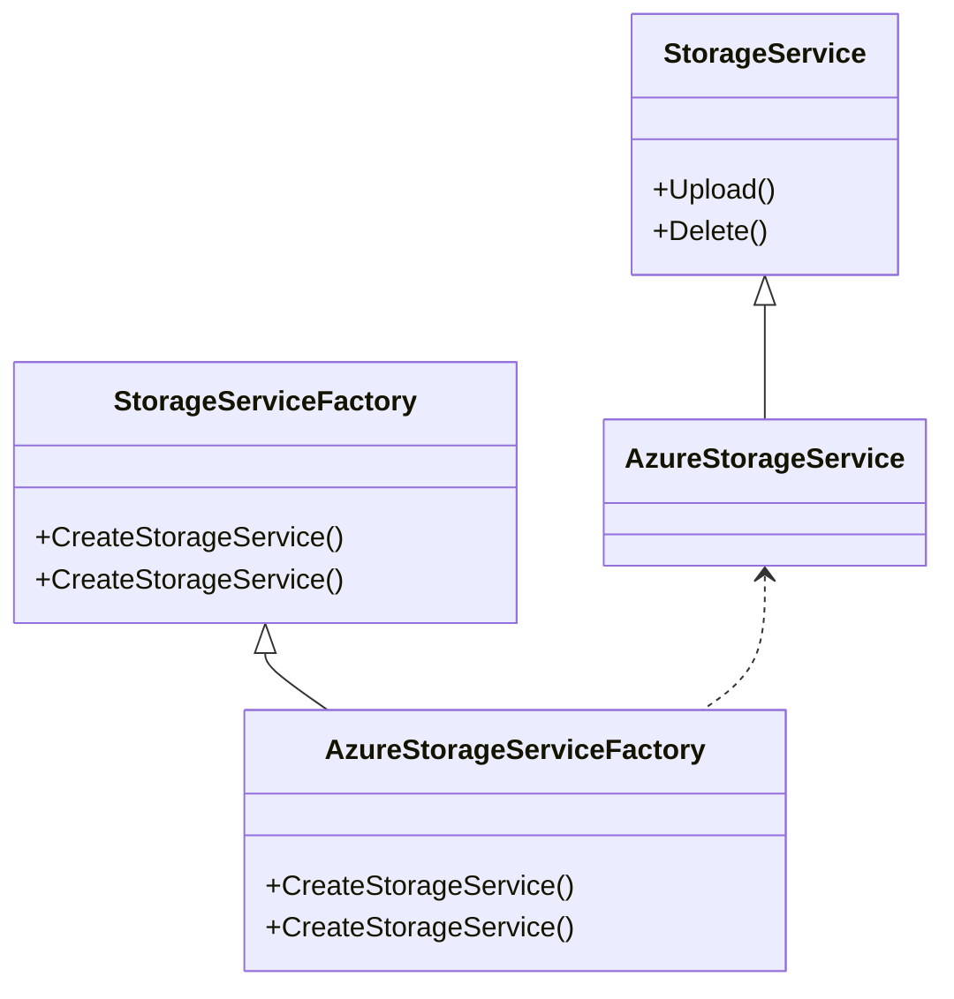

# Abstract Factory

The Abstract Factory design pattern provides an interface for creating families of related or dependent objects without specifying their concrete classes.

```mermaid
classDiagram
    StorageService <|-- AzureStorageService
    StorageServiceFactory <|-- AzureStorageServiceFactory
    StorageServiceFactory : +CreateStorageService()
    AzureStorageServiceFactory: +CreateStorageService()
    AzureStorageService <.. AzureStorageServiceFactory
    class StorageService{
        +Upload()
        +Delete()
    }
    class StorageServiceFactory{
        +CreateStorageService()
    }
    class AzureStorageServiceFactory{
        +CreateStorageService()
    }
```
