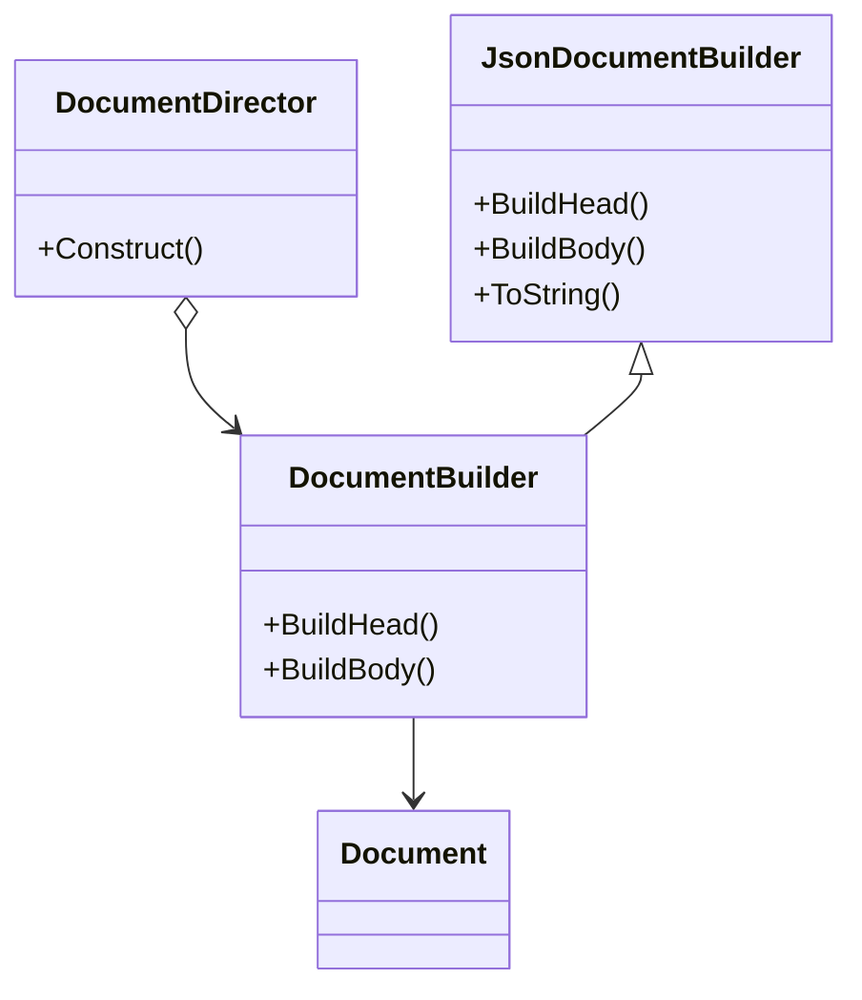

# Builder

The Builder design pattern separates the construction of a complex object from its representation so that the same construction process can create different representations. 

```mermaid
classDiagram
    DocumentDirector o--> DocumentBuilder
    JsonDocumentBuilder <|-- DocumentBuilder
    DocumentBuilder --> Document
    DocumentDirector : +Construct()
    DocumentBuilder: +BuildHead()
    DocumentBuilder: +BuildBody()
    JsonDocumentBuilder: +BuildHead()
    JsonDocumentBuilder: +BuildBody()
    JsonDocumentBuilder: +ToString()
```
