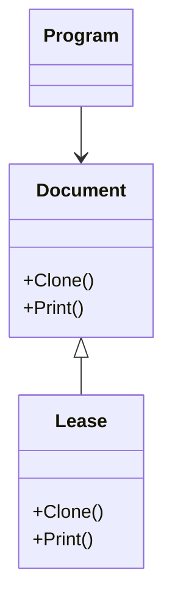

# Prototype Design Pattern
The Prototype Design Pattern is a creational pattern that simplifies object creation by cloning existing objects instead of instantiating them from scratch. This approach is particularly useful when object creation is resource-intensive or complex.

## Key Features
- Object Cloning: The pattern relies on cloning existing objects to create new ones. This is typically achieved using a clone() method, which duplicates the internal state of the object.
- Efficiency: By reusing existing objects as prototypes, the pattern reduces the overhead of creating objects from scratch, saving time and resources, especially for complex or costly initialization processes.
- Flexibility: It allows for the creation of objects with slight variations by modifying the cloned instance. This is ideal for scenarios where multiple similar objects are needed.
- Encapsulation of Complexity: The complexity of object creation is hidden from the client. The client interacts with the prototype and does not need to know the details of how the object is created.
- Dynamic Object Creation: The pattern supports dynamic configurations, enabling the creation of objects at runtime by cloning a base prototype and adjusting its properties as needed.
- Reusability: Prototypes act as templates, promoting code reuse and reducing redundancy in object creation logic.

## Components
- Prototype Interface: Defines the clone() method that all concrete prototypes must implement.
- Concrete Prototype: Implements the prototype interface and provides the specific cloning logic for the object.
- Client: Initiates the cloning process by interacting with the prototype, without needing to know the specifics of the concrete classes.

## Example Use Cases
- Game Development: Cloning characters, weapons, or environments with minor variations.
- Graphic Design Tools: Duplicating elements like shapes or layers for reuse or modification.
- Document Management: Creating templates that can be cloned and customized.
- Database Records: Generating modified versions of data objects without altering the original.

## When to Use
- When object creation is costly or complex.
- When managing multiple variations of similar objects.
- When dynamic object creation is required at runtime.
- When reducing initialization overhead is critical.

## When Not to Use
- If objects are simple to create and do not require significant resources.
- If objects are immutable and do not need variations.
- If the system has a straightforward and manageable object creation process.

The Prototype Design Pattern is a powerful tool for scenarios requiring efficient and flexible object creation, ensuring consistency while minimizing resource consumption.