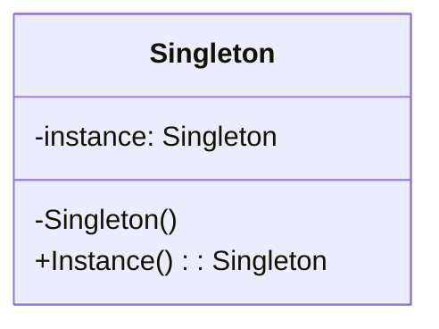

# Singleton Design Pattern
The Singleton design pattern ensures a class has only one instance and provide a global point of access to it.

## When to Use
- Configuration Manager: Centralized access to application settings.
- Logging Service: A single logger instance ensures consistent formatting and output.
- Database Connection Manager: Prevents multiple expensive or conflicting connections.
- Caching Layer: Shared in‑memory cache accessible across the application.
- Thread Pools: Coordinating a collection of worker threads.

## Key Points
- Ensures only one instance of a class exists.
- Provides a global access point to that instance.
- Constructor is private to prevent external creation.
- Often implemented with lazy initialization for efficiency.
- Useful for shared resources like loggers, caches, and configuration managers.

## Trade-off
Can make Unit Testing difficult because it introduces global state into the application.